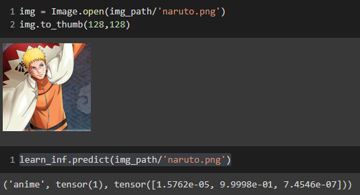
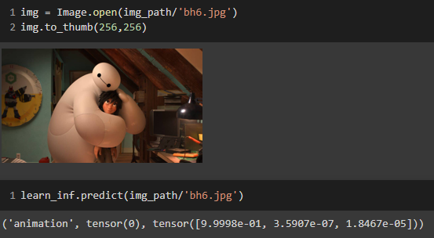
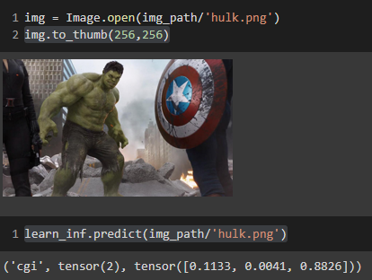

# Anime vs Animation vs CGI [Work in Progress]

An image classification project from data collection, machine learning to deployment. Defining the labels.  **anime:** anime characters from an original anime  **animation:** animation characters from an animation movie or series  **cgi:** CGI characters from a real movie [no animation]  

## Dataset construction and processing

**Data Gathering:** Downloaded from Google Images by  Google Image Search using keywords  **DataLoader:** Used fastai DataBlock API to set up the DataLoader.  **Data Augmentation:** fastai provides default data augmentation which operates in GPU. **Data Cleaning:** This part took the highest time. Since I collected data from Google Images, there were many noises. Also, there were images that contained anime and animation or anime and CGI, which is not my goal right now for this project. I cleaned and updated data using fastai ImageClassifierCleaner.  

## Training and inference 

**Training:** Fine-tuned a resnet50 model for 5 epochs and got upto 80% accuracy.  **Confusion Matrix:**  Looking into the confusion matrix I understood that the model can identify the anime and animation clearly but the 'CGI' images were confusing between anime and animation which actually is very logical if we think about it.  

**Setting up for Inference:** After more fixing, I set up the model for inference. The results on random images were satisfactory.  

### Result on anime

### Result on animation

### Result on CGI

